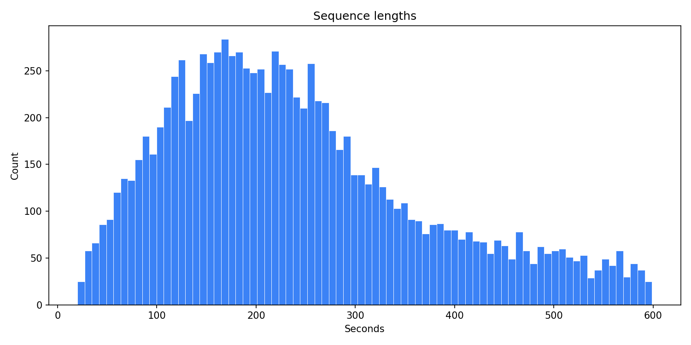
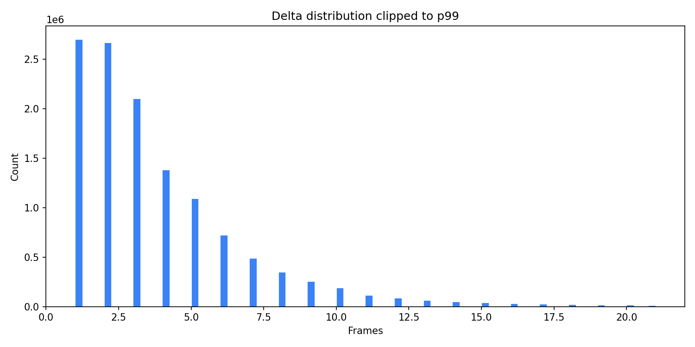
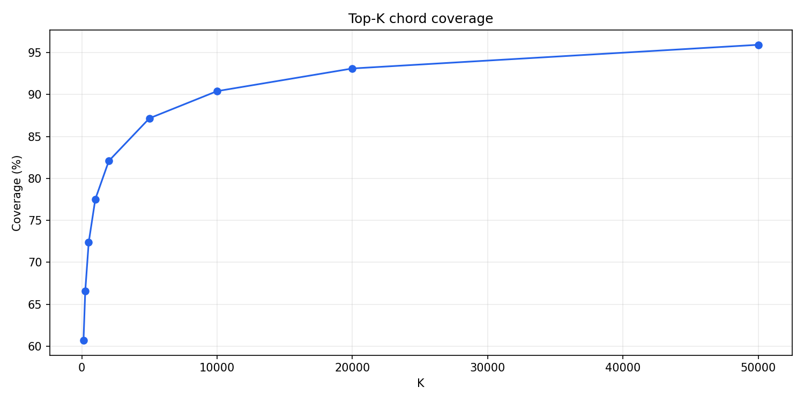
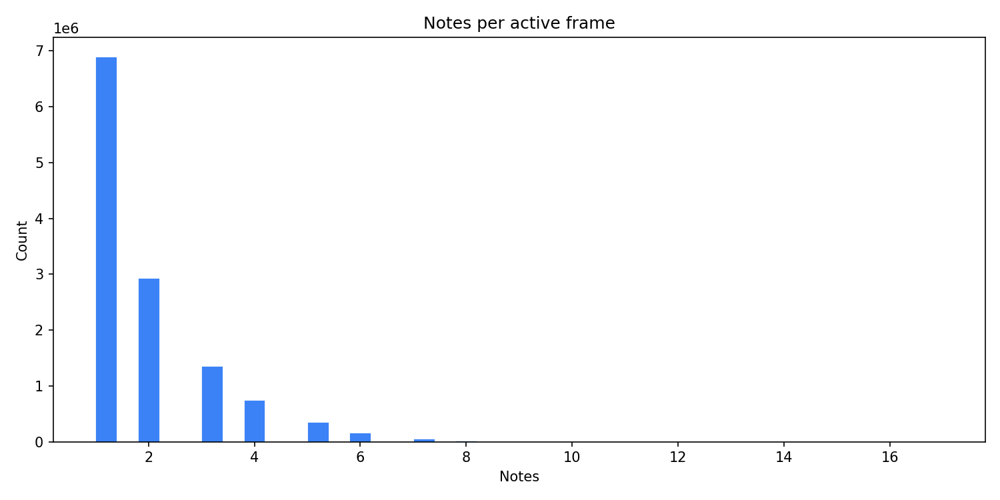
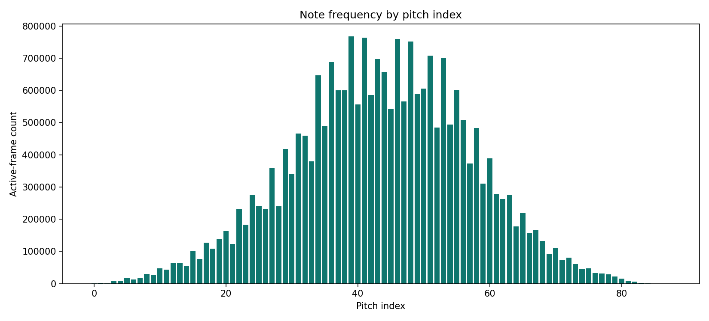

# Explicacion de `event_state_transformer`

Este documento explica que se hizo en `event_state_transformer/`, por que se hizo, y como se relaciona con el analisis del dataset.

El objetivo del modelo es generar continuaciones musicales a partir de piano-rolls binarios con forma:

```text
[T, 88]
```

Cada fila representa un instante de tiempo y cada columna una nota MIDI entre 21 y 108.

La prioridad no es solo bajar la loss de validacion. La prioridad es generar continuaciones coherentes, sin ruido aleatorio de notas y sin caer en loops repetitivos.

---

## 1. Por que se usa una representacion por eventos



El dataset contiene secuencias largas. Muchas duran varios minutos:

```text
media: 242.6 segundos
mediana: 220.3 segundos
p95: 509.1 segundos
```

Pero el piano-roll es muy sparse. Segun el analisis:

```text
frames totales: 51,456,090
frames activos: 12,548,532
frames vacios: 38,907,558
empty frames: 75.61%
active-frame ratio: 24.39%
```

Por eso no conviene entrenar directamente frame por frame. La mayoria del tiempo el modelo estaria aprendiendo a predecir silencio.

En cambio, `event_state_transformer` convierte cada piano-roll en una secuencia de eventos activos. Un evento representa un frame donde realmente suena al menos una nota.

Cada evento contiene:

```text
delta: cuantos frames pasaron desde el evento anterior
chord: ID del patron de notas activas
notes: vector binario de 88 notas
card: cantidad de notas activas
cum: posicion temporal acumulada
```

Esto comprime la secuencia y concentra el aprendizaje en los momentos musicalmente relevantes.

---

## 2. Delta modeling mas pequeno y realista



El `delta` indica cuanto tiempo pasa entre eventos activos.

Antes se usaba un `max_delta` muy grande, por ejemplo `1200`. Eso hacia que el modelo tuviera que aprender una distribucion temporal demasiado amplia, aunque casi todos los deltas reales son pequenos.

El analisis muestra:

```text
delta median: 3
delta p95: 10
delta p99: 21
delta p99.5: 29
```

Tambien muestra que los deltas mayores a 64 son raros:

```text
delta > 64: 0.08%
delta > 128: 0.02%
```

Por eso se cambio el default a:

```bash
--max-delta 64
```

Esto conserva casi todos los casos reales, pero hace que la prediccion temporal sea mas facil y estable.

---

## 3. Vocabulario de acordes top-k



Cada frame activo tiene un patron de notas. A ese patron lo llamamos `chord state`.

El dataset tiene muchos estados distintos:

```text
unique non-empty chord states: 344,137
total chord events: 12,548,532
```

Usar los 344k estados como vocabulario haria que el softmax fuera muy grande y dificil de entrenar.

El analisis muestra esta cobertura:

```text
top_k = 10,000 -> 90.40%
top_k = 20,000 -> 93.10%
top_k = 50,000 -> 95.92%
```

`top_k=50,000` cubre un poco mas, pero vuelve el modelo bastante mas pesado. Por eso se cambio el default a:

```bash
--top-k 20000
```

Este valor cubre la mayoria de eventos sin hacer el softmax innecesariamente dificil.

---

## 4. Multiples random crops por secuencia

Las piezas son largas, y antes cada pieza contribuia muy poca variedad por epoca. Eso significa que el modelo podia ver solo una parte de cada secuencia larga durante una epoca.

Se agrego a `EventChunkDataset`:

```python
samples_per_sequence: int = 1
```

Cuando `random_crop=True`, el largo del dataset ahora es:

```python
len(self.events) * samples_per_sequence
```

Y cada indice se mapea de vuelta a una secuencia original con:

```python
index % len(self.events)
```

En entrenamiento se usa:

```bash
--samples-per-sequence 8
```

Esto hace que cada pieza larga pueda aportar varios chunks aleatorios por epoca. Asi el modelo ve mas regiones del dataset sin duplicar archivos.

Validacion se mantiene deterministica:

```text
random_crop=False
samples_per_sequence=1
```

---

## 5. Cardinality head: predecir cuantas notas deben sonar



Esta grafica es una de las mas importantes para mejorar la generacion.

La mayoria de eventos tienen pocas notas:

```text
1 nota: 54.97%
2 notas: 23.38%
3 notas: 10.77%
4 notas: 6.00%
5 notas: 2.86%
6 notas: 1.28%
7 notas: 0.48%
10+ notas: 0.02%
```

Esto significa que una continuacion razonable normalmente debe producir entre 1 y 4 notas por evento. Eventos con mas de 7 notas deberian ser muy raros.

Antes, el modelo no tenia una cabeza explicita para predecir la cantidad de notas. Eso podia causar dos problemas:

```text
1. demasiadas notas activas al mismo tiempo
2. ruido aleatorio cuando se usaba el note_head
```

Ahora el modelo tiene una cabeza adicional:

```python
self.card_head = nn.Linear(d_model, num_notes + 1)
```

Y el `forward` devuelve:

```python
"card_logits": self.card_head(x)
```

El dataset tambien devuelve:

```python
"card_target": torch.as_tensor(card[1:], dtype=torch.long)
```

Esto permite entrenar al modelo para predecir explicitamente cuantas notas debe tener el siguiente evento activo.

---

## 6. Loss rebalanceada

Antes la loss era:

```python
loss = delta_loss + chord_loss + 0.25 * note_loss
```

Esto hacia que la reconstruccion nota por nota tuviera poco peso.

Ahora se usa:

```python
loss = (
    1.0 * delta_loss
    + 0.5 * chord_loss
    + 1.0 * note_loss
    + 0.5 * card_loss
)
```

La idea es:

```text
delta_loss: importante para el ritmo
chord_loss: util, pero no debe dominar
note_loss: importante para reconstruccion real de notas
card_loss: importante para controlar densidad musical
```

Las metricas ahora incluyen:

```text
loss
delta_ce
chord_ce
note_bce
card_ce
```

---

## 7. Generacion mas controlada

La generacion tambien fue mejorada.

Ahora `generate.py` hace:

```text
1. predice delta
2. predice chord
3. predice cardinalidad
4. decide si usar el chord conocido o el note_head
5. si usa note_head, genera exactamente k notas
```

Antes, el fallback podia activar notas con Bernoulli independiente sobre las 88 notas. Eso puede crear ruido porque cada nota se decide por separado.

Ahora se agrego:

```python
sample_notes_with_cardinality(note_logits, k)
```

Esta funcion genera exactamente `k` notas activas, donde `k` viene de la cabeza de cardinalidad.

Tambien se agregaron controles:

```bash
--max-notes 7
--min-notes 1
--repeat-penalty 1.15
--max-same-chord-run 3
--prefer-note-head-prob 0.25
```

Estos parametros ayudan a evitar:

```text
1. acordes con demasiadas notas
2. loops del mismo acorde
3. ruido por activacion independiente de muchas notas
4. dependencia excesiva del vocabulario de chords
```

Durante generacion:

```text
PAD, BOS y EOS se bloquean como chords normales
delta 0 se bloquea
si un chord se repite demasiado, se penaliza
si el chord decodificado tiene demasiadas notas, se reemplaza por note_head
si el chord es desconocido, se usa note_head
```

---

## 8. Distribucion de notas



El dataset usa principalmente el registro medio. Las notas extremas aparecen muy poco.

Por ejemplo, las notas MIDI mas frecuentes incluyen:

```text
60, 62, 67, 69, 72, 74, 64, 57
```

Y las notas extremas como 108, 107, 106 aparecen muy pocas veces.

Esto importa porque el `note_head` aprende probabilidades por nota. Cuando el modelo no puede usar un chord conocido, el `note_head` sirve como fallback para elegir notas plausibles segun lo aprendido.

---

## 9. RoPE

Se agrego el argumento:

```bash
--use-rope
```

Pero RoPE no fue implementado internamente todavia.

La razon es que el modelo usa:

```python
nn.TransformerEncoderLayer
```

Para aplicar RoPE correctamente habria que reemplazar esa capa por una implementacion custom de self-attention. Hacer eso rapido seria riesgoso y podria romper entrenamiento.

Por ahora, si se usa:

```bash
--use-rope
```

el script registra la opcion y muestra un warning, pero mantiene embeddings posicionales absolutos.

---

## 10. Comando recomendado de entrenamiento

Desde dentro de `event_state_transformer/`:

```bash
python train.py \
  --data-dir .. \
  --out-dir runs/event_state_v2_k20k_d64 \
  --top-k 20000 \
  --max-delta 64 \
  --context-len 1024 \
  --samples-per-sequence 8 \
  --epochs 60 \
  --batch-size 16 \
  --lr 2e-4 \
  --warmup-steps 300 \
  --d-model 512 \
  --n-layers 8 \
  --n-heads 8 \
  --d-ff 2048 \
  --dropout 0.1 \
  --num-workers 4
```

Si la memoria de la A100 alcanza, se puede probar:

```bash
--batch-size 24
```

o:

```bash
--batch-size 32
```

---

## 11. Comando recomendado de generacion

```bash
python generate.py \
  --data-dir .. \
  --checkpoint runs/event_state_v2_k20k_d64/best.pt \
  --out runs/event_state_v2_k20k_d64/eval_set_01_generated_event_state_v2.npz \
  --delta-temp 0.8 \
  --chord-temp 0.95 \
  --chord-top-p 0.92 \
  --note-temp 0.9 \
  --card-temp 0.9 \
  --max-notes 7 \
  --repeat-penalty 1.15 \
  --max-same-chord-run 3 \
  --prefer-note-head-prob 0.25
```

---

## 12. Exportar audio

Despues de generar el `.npz`, se puede exportar audio WAV con:

```bash
python generate_wav.py \
  --npz runs/event_state_v2_k20k_d64/eval_set_01_generated_event_state_v2.npz \
  --out-dir runs/event_state_v2_k20k_d64/wav \
  --limit 1
```

Esto genera un archivo `.wav` para escuchar la primera secuencia.

---

## Resumen final

Los cambios principales fueron:

```text
1. max_delta mas pequeno y realista
2. vocabulario top_k=20000
3. multiples random crops por secuencia
4. nueva cabeza de cardinalidad
5. loss con mas peso para notas y cardinalidad
6. generacion con sampling controlado por cardinalidad
7. penalizacion de repeticion
8. fallback mas seguro al note_head
9. soporte CLI para --use-rope, aunque RoPE queda postergado
```

La mejora conceptual mas importante es que el modelo ya no solo intenta predecir el proximo chord ID. Ahora tambien aprende:

```text
cuando ocurre el proximo evento
cuantas notas debe tener
que notas especificas son plausibles
como evitar repeticiones demasiado largas
```

Eso deberia producir continuaciones con menos ruido y menos loops repetitivos.
